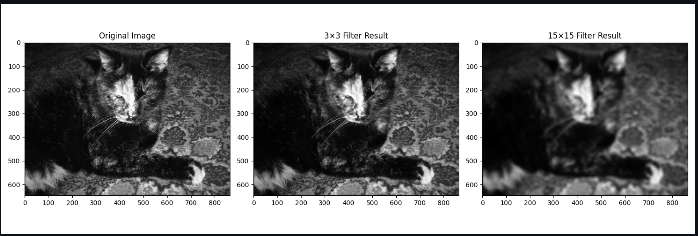

# 图像平均滤波实验报告

## 实验目的
1. 理解图像平均滤波的基本原理, 理解卷积的意义
2. 掌握使用不同尺寸滤波器对图像进行平滑处理的方法
3. 分析不同尺寸滤波器对图像处理效果的影响

### 实验任务 

(a) 创建3×3平均滤波器
```python
small_filter = np.ones((3,3))/9
 ```
 (b) 应用小滤波器处理图像
```python
small_result = sim.convolve(img, small_filter)
 ```
 (c) 创建并应用15×15平均滤波器
```python
large_filter = np.ones((15,15))/(15*15)
large_result = sim.convolve(img, large_filter)
 ```

#结果展示
细碎尘埃: 04-09 10:40:19
import numpy as np
import scipy.ndimage as sim
import matplotlib.pyplot as plt

def create_small_filter():
    """创建3×3平均滤波器"""
    return np.ones((3, 3)) / 9

def create_large_filter():
    """创建15×15平均滤波器"""
    return np.ones((15, 15)) / (15*15)

def process_image(input_file):
    """处理图像并保存结果"""
    # 读取图像
    img = plt.imread(input_file)
    
    # 创建滤波器
    small_filter = create_small_filter()
    large_filter = create_large_filter()
    
    # 应用卷积
    small_result = sim.convolve(img, small_filter)
    large_result = sim.convolve(img, large_filter)
    
    # 显示结果
    plt.figure(figsize=(15, 5))
    
    plt.subplot(1, 3, 1)
    plt.imshow(img, cmap='gray')
    plt.title('Original Image')
    
    plt.subplot(1, 3, 2)
    plt.imshow(small_result, cmap='gray')
    plt.title('3×3 Filter Result')
    
    plt.subplot(1, 3, 3)
    plt.imshow(large_result, cmap='gray')
    plt.title('15×15 Filter Result')
    
    plt.tight_layout()
    plt.show()

if __name__ == "__main__":
    process_image('data/bwCat.tif')

Ys: 04-09 10:55:05


## 实验结果分析
1. 总结不同尺寸滤波器的特点
2. 分析滤波器尺寸对处理效果的影响
3. 探讨实际应用中的选择策略

## 解释卷积的作用和影响